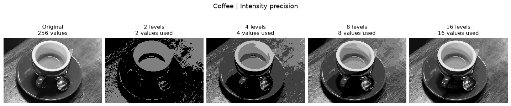

# Digital Image Processing — Week 2

**Group members: Nmertgules and Iliya**

Five Jupyter notebooks explore spatial resolution, intensity quantization, processing-time comparisons, and linear brightness/contrast transforms. Every notebook has been executed on **two different web photographs**, with its plots, measurements, and verification outputs saved for viewing directly on GitHub.



*Saved result from Task 02: the original coffee photograph and its 2-, 4-, 8-, and 16-level grayscale versions.*

## Notebooks

| Task | Notebook | What it demonstrates |
| --- | --- | --- |
| 01 | [Image resizing](week2/01_resize_image.ipynb) | 0.25x, 0.5x, 2x, and 4x scaling with area/cubic interpolation |
| 02 | [Intensity quantization](week2/02_intensity_quantization.ipynb) | Available gray levels, banding, and quantization error |
| 03 | [Four levels and a sixteen-step palette](week2/03_four_to_sixteen_level_mapping.ipynb) | Palette remapping versus direct 16-level quantization |
| 04 | [Whole image versus quadrants](week2/04_whole_image_vs_quadrants.ipynb) | Equivalent output and measured runtime with variability |
| 05 | [Brightness and contrast](week2/05_brightness_contrast.ipynb) | NumPy/OpenCV pixel agreement, histograms, and timing |

## Photographs and provenance

- **Astronaut:** NASA portrait, 512 x 512 pixels, public domain.
- **Coffee:** photograph by Rachel Michetti, courtesy of Pikolo Espresso Bar, 600 x 400 pixels, CC0.

The original files are included under [week2/assets/](week2/assets/). [Source credits](week2/assets/README.md) document the versioned download URLs, licensing references, and SHA-256 hashes. The notebooks verify the files before processing them. When opened alone in Colab, they download the same verified inputs automatically.

## Execution evidence

**5 notebooks · 20 executed code cells · 10 embedded figures · 0 cell errors**

Each notebook ran from top to bottom in a fresh IPython kernel. Both photographs passed the relevant numerical checks, including quantization bounds, odd-sized image handling, output equality, and a comparison over all 256 possible intensity values. All 10 resulting figures were visually reviewed for readable labels, consistent intensity scales, and complete layouts.

See the [execution and validation record](week2/VALIDATION.md) and [machine-readable measurements](week2/validation.json). Notebook outputs are intentionally retained so the results are visible without rerunning anything.

## Reproduce the results

The saved executions used Python 3.12 on Windows. Exact tested package versions are listed in [requirements.txt](requirements.txt).

Create a virtual environment, activate it, and install the dependencies:

```bash
python -m venv .venv
```

On Windows PowerShell, activate with `.venv\Scripts\Activate.ps1`; on macOS/Linux, use `source .venv/bin/activate`.

```bash
python -m pip install -r requirements.txt
python -m nbconvert --to notebook --execute --inplace week2/01_resize_image.ipynb
```

Replace the notebook path to execute another task. To use the Jupyter browser interface, additionally install `notebook` with `python -m pip install notebook`, run `jupyter notebook`, and choose **Restart Kernel and Run All**. VS Code with its Jupyter extension is also suitable.

## Interpreting the results

- Resizing changes the sample grid; upsampling cannot recreate missing spatial detail.
- Four quantized codes remain at most four values after palette remapping. Genuine 16-level quantization needs the original intensities.
- Whole-image and quadrant processing produce identical pixels here because the operation is independent for each pixel. Timings include conversion/allocation and, for quadrants, splitting and reassembly; the ranking can vary with the image and machine.
- The transform `0.75x + 20` lifts dark intensities and compresses contrast. Intensities above 80 decrease, so a positive offset does not guarantee a higher mean brightness.
