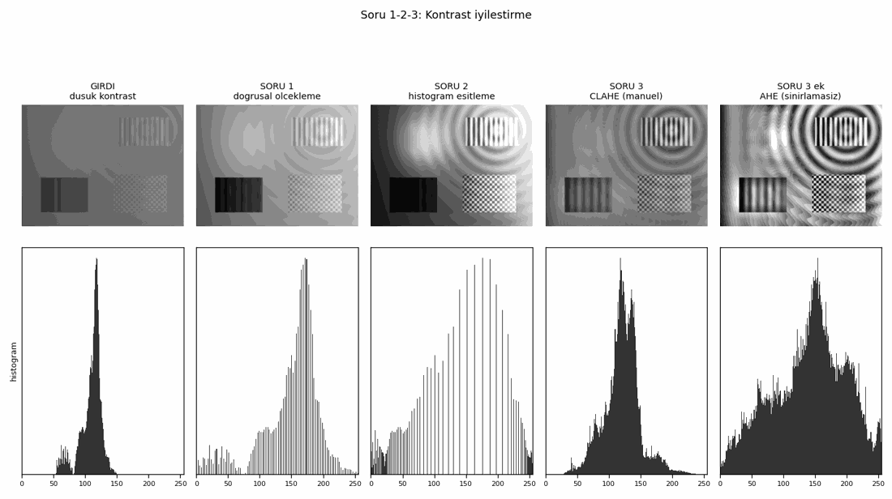
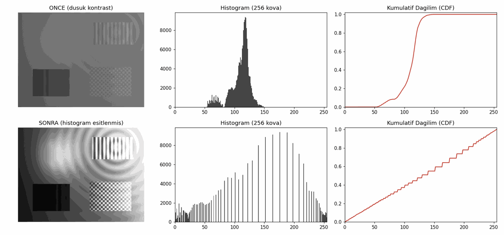
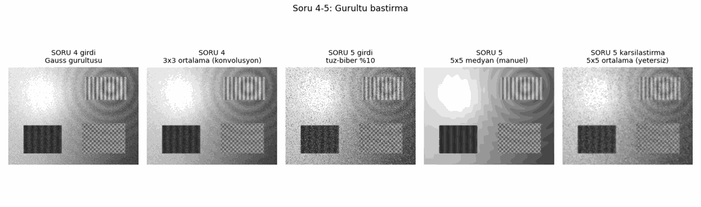

# Digital Image Processing — Week 3

**Group members: Nmertgules and Iliya**

Five tasks cover contrast stretching, histogram equalization, CLAHE, mean filtering, and median filtering.

## Tasks and measured results

All five scripts were executed on the supplied synthetic grayscale inputs (384 × 512 pixels). The figures below show saved results from that run.

| Task | Implementation and result |
| --- | --- |
| [01 · Linear contrast stretching](soru1_dogrusal_olcekleme.py) | Minimum and maximum found with loops; manual scaling expanded the input range **54–149 to 0–255**. The loop and vectorized implementations matched OpenCV normalization on this input: maximum pixel difference **0**. |
| [02 · Histogram equalization](soru2_histogram_esitleme.py) | The 256-bin histogram, cumulative counts, and mapping were calculated manually. Histogram total and final cumulative count both equaled **196,608 pixels**. Output range: **0–255**; maximum difference from OpenCV equalization: **0**. [Saved output image](cikti/soru2_histogram_esitlenmis.png). |
| [03 · CLAHE](soru3_clahe.py) | OpenCV CLAHE and the manual implementation were compared using **clipLimit=8, tileGridSize=(8,8)**. Maximum pixel difference: **0**. The script's six additional parameter comparisons and its 500 × 377 cropped-input test also matched. |
| [04 · 3×3 mean convolution](soru4_ortalama_filtre.py) | A manual convolution with nine coefficients of **1/9** suppressed Gaussian noise. Results matched both OpenCV blur and filter2D: maximum pixel difference **0**. PSNR against the clean reference increased from **22.35 to 29.26 dB**. |
| [05 · 5×5 median filter](soru5_medyan_filtre.py) | Both the loop implementation with manual insertion sorting and the vectorized implementation matched OpenCV medianBlur: maximum pixel difference **0**. The additional random, single-row, small-image, constant-image, and 3×3-kernel comparisons passed. PSNR increased from **14.94 to 35.05 dB** on the salt-and-pepper input. |

PSNR measures similarity to the clean reference; higher values indicate lower error here. These measurements apply to the tested inputs.

## Result figures

### Tasks 01–03: contrast enhancement



The original image has a narrow intensity range. Stretching expands that range, global equalization redistributes intensities, and CLAHE enhances local contrast. The last panel is an additional AHE comparison without contrast limiting.

### Task 02: histogram and CDF



### Tasks 04–05: noise suppression



The final panel compares a 5×5 mean filter on salt-and-pepper noise. The median filter produced lower error on this input. Display figures are reduced previews; the linked Task 02 output retains its original pixels.

## Known limitations

Independent tests found two cases not covered by the scripts' successful main comparisons:

- Manual histogram equalization maps a constant image to zero; OpenCV preserves the constant value (tested with intensity 128).
- Manual CLAHE can differ from OpenCV for some image dimensions because of border padding. A random 32 × 33 image with clipLimit=2 and an 8×8 grid had a maximum pixel difference of 62.

The code is unchanged, so these limitations remain. No explicit multithread or CUDA implementation is included.

## Run

Install NumPy, OpenCV, and Matplotlib. Generate the default inputs first, then execute the tasks:

```bash
python -m pip install numpy opencv-python matplotlib
python week3/00_test_goruntusu_olustur.py
python week3/soru1_dogrusal_olcekleme.py
python week3/soru2_histogram_esitleme.py
python week3/soru3_clahe.py
python week3/soru4_ortalama_filtre.py
python week3/soru5_medyan_filtre.py
python week3/06_karsilastirma_gorseli.py
```

Each task accepts an input image path; Tasks 04 and 05 also accept a clean reference path for quality measurements. Generated inputs and results are saved in `week3/cikti/`.

Tested on 2026-10-05 using Python 3.12.14, NumPy 2.3.5, OpenCV 5.0.0 (opencv-python-headless 5.0.0.93), and Matplotlib 3.10.8 on Linux.
